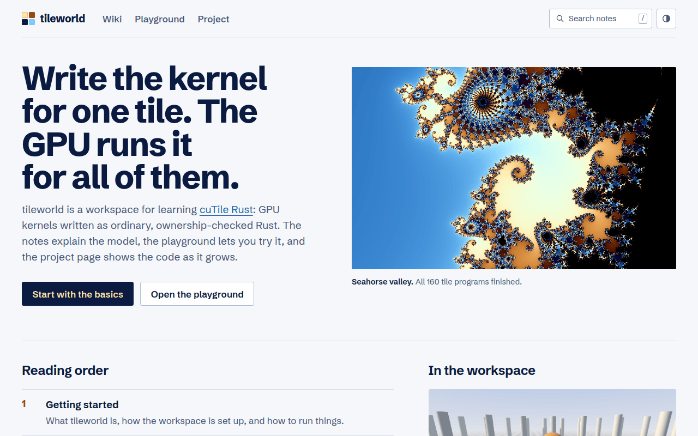
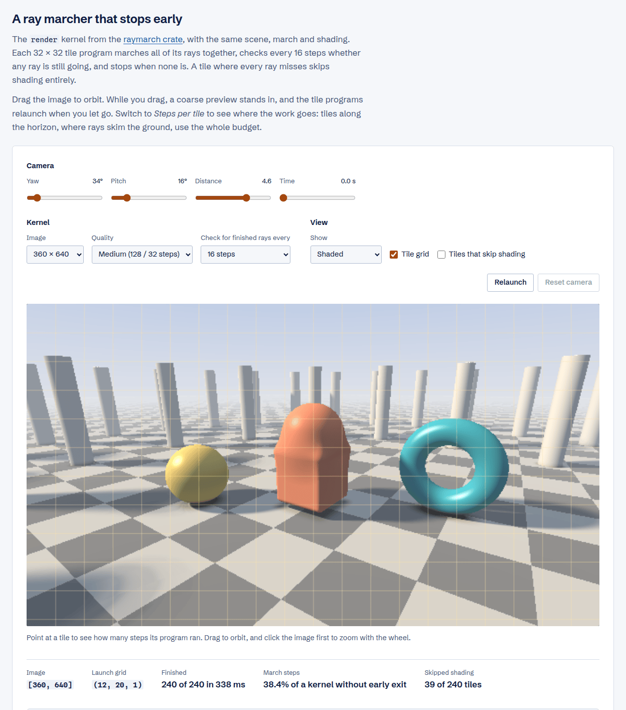
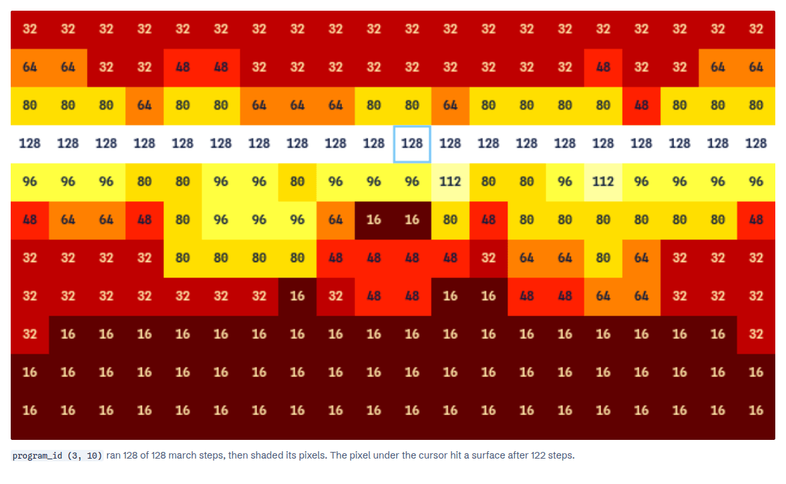
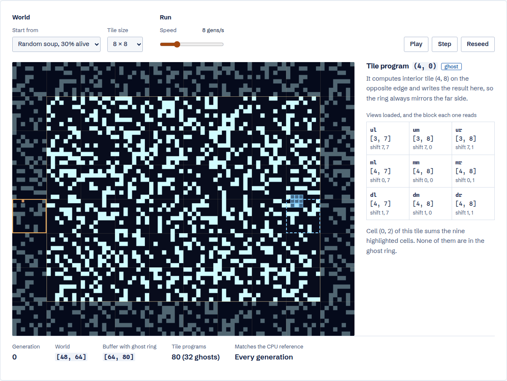
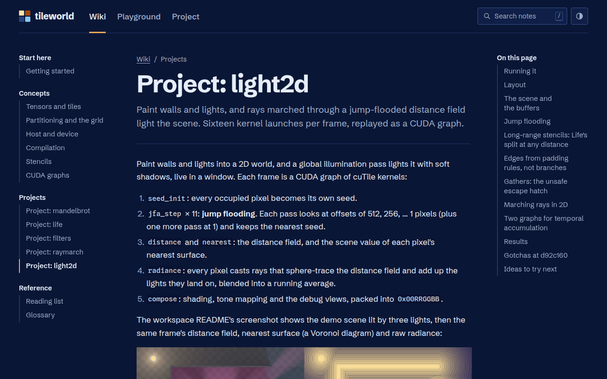
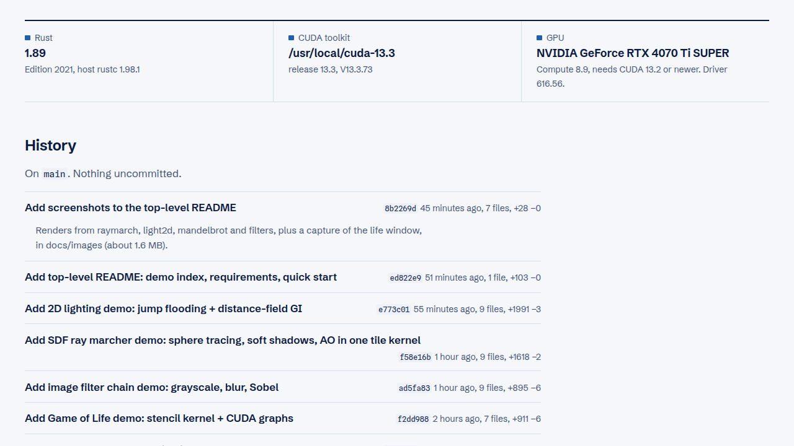
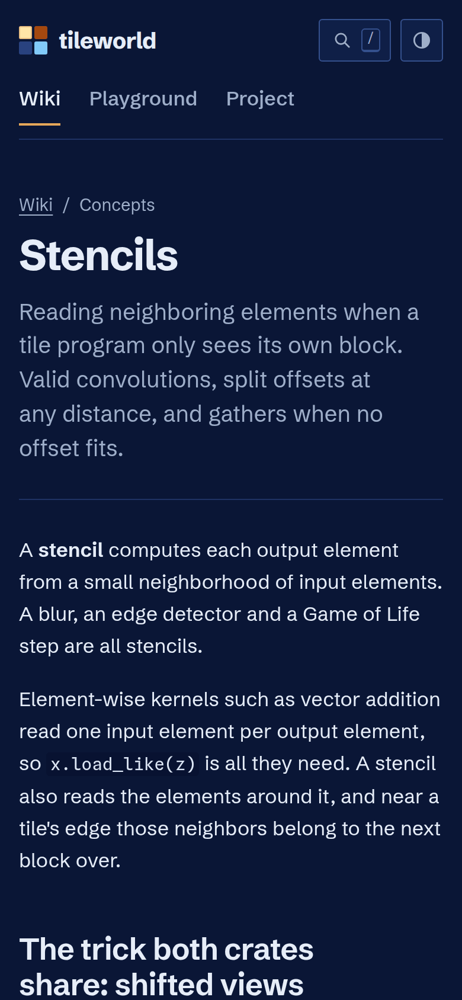

# tileworld-web

A small Deno + Fresh 2 site that works as the wiki, demo area and learning
notebook for [rust-gpu-lab](https://github.com/phiat/rust-gpu-lab), a Rust
workspace for learning [cuTile Rust](https://github.com/NVlabs/cutile-rs). The
site calls that workspace tileworld, after its local checkout.



Needs [Deno](https://deno.com) 2.x; nothing else to install.

```bash
deno task dev      # http://localhost:5173
deno task check    # fmt + lint + type-check
deno task build && deno task start
```

The wiki and playground work on their own. The project page needs a local
checkout of the workspace (see
[Where the workspace is](#where-the-workspace-is)).

## What's here

| Route         | What it is                                                                                                        |
| ------------- | ----------------------------------------------------------------------------------------------------------------- |
| `/`           | Reading order, a live tile-by-tile render, and a glance at the workspace                                          |
| `/wiki`       | Markdown notes from `content/`. Edit or add a file and refresh.                                                   |
| `/playground` | Islands: a partition → launch grid explorer, a tile-by-tile Mandelbrot, Life, and a ray marcher                   |
| `/project`    | The tileworld workspace read live from disk: git history, GPU/CUDA probe, deps, crate READMEs and source, renders |
| `/api/search` | JSON index of every note (title, summary, headings) for the search palette                                        |

Press `/` or Ctrl+K anywhere to search notes. The header button switches between
system, light and dark themes; the choice is kept in `localStorage`. Every code
block has a copy button.

The Mandelbrot demo keeps its view in the URL hash
(`#view=cx,cy,span&iters=…&tile=…`), so a zoomed-in view can be shared. It also
prints the `cargo run … render` command that renders the same view on the GPU.

## Screenshots

**Playground: the ray marcher.** The raymarch crate's `render` kernel, run tile
program by tile program on the CPU. Drag to orbit; the readouts show how much of
the march budget early exit saved and how many tiles skipped shading.



**Steps per tile.** The same frame in the kernel's debug view. Tiles in front of
the camera stop after 16 steps, sky tiles after 32, and tiles along the horizon
use the whole budget.



**Playground: Life with a ghost ring.** Pointing at a ghost tile shows the
interior tile it recomputes (dashed) and the nine views its program loads.



**Wiki, dark theme.** Every note has section navigation and an outline. This is
the `light2d` project note.



**Project page.** Toolchain and GPU probe, then the workspace's git history,
read from disk on each request.



**On a phone.** The stencils note at 390 px wide.



## Notes

Each note is `content/<slug>.md` with front matter:

```yaml
---
title: Tensors and tiles
summary: One line for listings.
order: 2 # sort order
section: Concepts # sidebar group
---
```

Link notes to each other with relative links
(`[grid](./partitioning-and-the-grid.md)`). Those links become
`/wiki/partitioning-and-the-grid`. Raw HTML passes through, so exercise answers
can go in `<details><summary>Show answer</summary> … </details>` (leave blank
lines around the markdown inside).

The project page links a crate to `/wiki/<crate name>` only when that note
exists.

## Where the workspace is

`/project` reads `../../tileworld` relative to the working directory by default.
Clone [rust-gpu-lab](https://github.com/phiat/rust-gpu-lab) anywhere and point
the site at it with `TILEWORLD_DIR=/path/to/rust-gpu-lab`. Both `dev` and
`start` must run from this directory, which is also where notes load from.

The project page reads files and runs `git` in that directory, so keep the
server on your own machine. `deno task start` listens on all interfaces
(`0.0.0.0`), unlike `deno task dev`.

`/project` shows PNG and JPEG images from the workspace root and up to two
folders deep, such as `filters-out/` and the README screenshots in
`docs/images/`. Notes can embed those, as in
``, but only when the
workspace is present. Images a note always needs belong in `static/images/`. It
also lists the last 10 commits plus anything uncommitted when the workspace is a
git repo.

`islands/LifeStencil.tsx` ports `life_step` from `life/src/gpu.rs` (ghost-ring
aliasing, offset-split views, branch-free rule) and checks it against a port of
`life/src/cpu.rs` every generation. Update it if the kernel changes.

`lib/mandelbrot.ts` mirrors `mandelbrot/src` (pixel mapping, bailout, palette,
early-exit step counts) for both the home page render and the playground. Update
it if those change, and check the preset locations still look right.

`lib/raymarch.ts` ports the `render` kernel from `raymarch/src/gpu.rs`, with the
scalar math from `cpu.rs`: rays march in lockstep per 32 × 32 tile, and tiles
exit early and skip shading the way the kernel does. Update it if the scene,
shading, quality presets or camera change.

Restart `deno task dev` after adding a new island. The running Vite server
doesn't register it, and every island on the page stops hydrating until then.

## Layout

```text
content/      markdown notes
lib/          wiki loader, markdown + highlighting, workspace reader,
              mandelbrot and raymarch math, tile helpers for the islands
islands/      GridExplorer, TileMandelbrot, LifeStencil, TileRaymarch,
              HeroRender, SearchPalette, ThemeToggle (client-side)
components/   WikiNav
routes/       pages; project/renders/[...path].ts serves PNGs from the workspace,
              api/search.ts serves the search index
assets/       styles.css; colors come from the crate's cosine palette
client.ts     loads the stylesheet and wires up copy buttons
static/       favicon, and images that notes embed
docs/images/  README screenshots
docs/ideas.md what the site could do next
```

## License

MIT. See [LICENSE](LICENSE).
